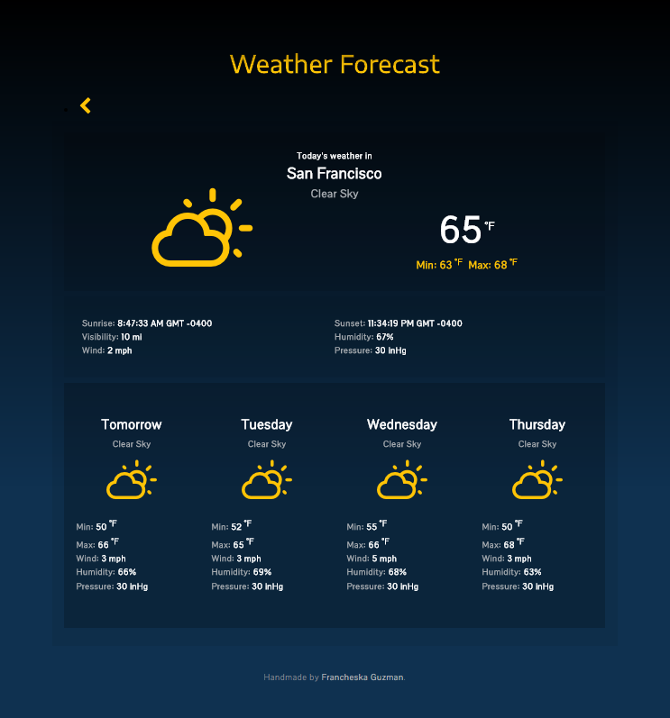

# Weather Forecast

Agency Within <b>|</b> Front End Developer Test

Francheska Guzman

## Description

The Weather Forecast is a web application that provides information such as weather condition and temperature of five cities. It is designed for computer, tablet, and mobile.

## Technologies Used

HTML, CSS, JavaScript, JSX, and React.

## OpenWeatherMap API

I used the following API endpoints from the OpenWeatherMap:

* [Current weather data](https://www.openweathermap.org/current)
* [5 day / 3 hour forecast](https://www.openweathermap.org/forecast5)

## Icons

* [Weather Icons](http://erikflowers.github.io/weather-icons/)
* [FontAwesome](https://fontawesome.com/)

## Examples

### Mobile

### Computer

## Live

https://francheska-guzman.github.io/weather-forecast/
