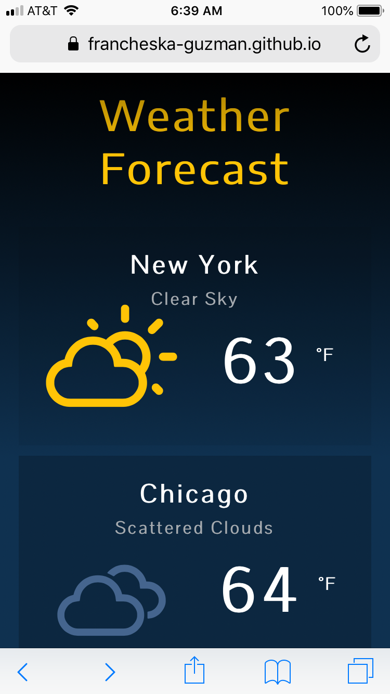
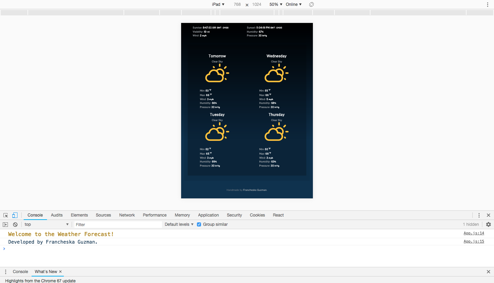

# Weather Forecast

The Weather Forecast web application provides actual data of five cities such as minimum and maximum temperature, wind, humidity, and pressure.

## Technologies Used

HTML, CSS, JavaScript, JSX, and React.

## OpenWeatherMap API

I used the following API endpoints from the OpenWeatherMap:

* [Current weather data](https://www.openweathermap.org/current)
* [5 day / 3 hour forecast](https://www.openweathermap.org/forecast5)

## Icons

* [Weather Icons](http://erikflowers.github.io/weather-icons/)
* [FontAwesome](https://fontawesome.com/)

## Cross-browser Compatibility

### Mobile

### Tablet

### Computer

## Live

https://francheska-guzman.github.io/weather-forecast/
